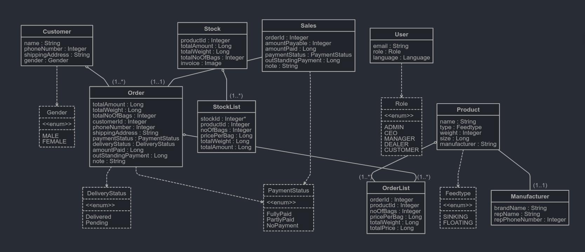

# Product Requirements Document (PRD) for FATOG Inventory Management System

## 1. Introduction

### 1.1 Purpose

The purpose of this document is to outline the requirements and functionalities of the FATOG inventory management system.

### 1.2 Scope

The inventory management system aims to streamline the processes related to managing products, sales, inventories, users, and suppliers and customers for FATOG fisheries.

### 1.3 Audience

The primary audience for this document includes stakeholders, product managers, developers, and designers involved in the development of the inventory management system.

## 2. Overview

### 2.1 Goals

- Provide a user-friendly interface for managing products, sales, inventories, users, customers, and suppliers.
- Automate inventory tracking, sales management, and order processing.
- Generate reports and analytics to facilitate decision-making and business growth.

### 2.2 Features

- CRUD operations for products, sales, inventories, users, and suppliers.
- Real-time inventory tracking and management.
- Sales statistics and profit calculations.
- Order management and email notifications.
- Reporting and analytics dashboard.

## 3. Functional Requirements

### 3.1 Product Management

- Ability to add, view, update, and delete products.
- Product categorization and attributes (e.g., name, description, price, quantity).
- Image upload for products.

### 3.2 Sales Management

- Creation of sales orders/invoices.
- Integration with product inventory for real-time stock updates.
- Sales order status tracking (e.g., pending, shipped, delivered).

### 3.3 Inventory Management

- Inventory tracking and stock level monitoring.
- Automatic stock replenishment alerts.
- Barcode scanning for inventory management.

### 3.4 User Management

- User authentication and authorization.
- CRUD operations for user accounts.
- Role-based access control (e.g., admin, salesperson, manager).

### 3.5 Supplier Management

- Addition, view, update, and deletion of supplier details.
- Supplier product catalog management.
- Purchase order generation and tracking.

### 3.6 Reporting and Analytics

- Sales reports by day, week, month, and year.
- Profit calculation based on buying and selling prices.
- Inventory turnover rate calculation.
- Customizable dashboard for analytics.

## 4. Non-Functional Requirements

### 4.1 Performance

- System should handle concurrent user requests efficiently.
- Response times should be optimized for a seamless user experience.

### 4.2 Security

- Data encryption for sensitive information.
- Role-based access control to restrict unauthorized access.
- Regular security audits and vulnerability assessments.

### 4.3 Scalability

- System should be scalable to accommodate future growth.
- Support for horizontal scaling by adding more servers or instances.

### 4.4 Reliability

- Minimal downtime and high availability.
- Data backups and disaster recovery mechanisms in place.

## 5. Assumptions and Constraints

- Availability of internet connectivity for cloud-based deployment.
- Compatibility with modern web browsers and devices.
- Compliance with regulatory requirements (e.g., GDPR, PCI-DSS).

## 6. Glossary

- List of terms and acronyms used throughout the document.

## 7. Appendix

- Additional information, diagrams, or mockups.

### 7.1 Database Entity Relation Diagram

---

This PRD provides a comprehensive overview of the inventory management system, outlining its goals, features, functional and non-functional requirements, as well as any assumptions and constraints. It serves as a guide for the development team to ensure alignment with stakeholder expectations and project goals.
